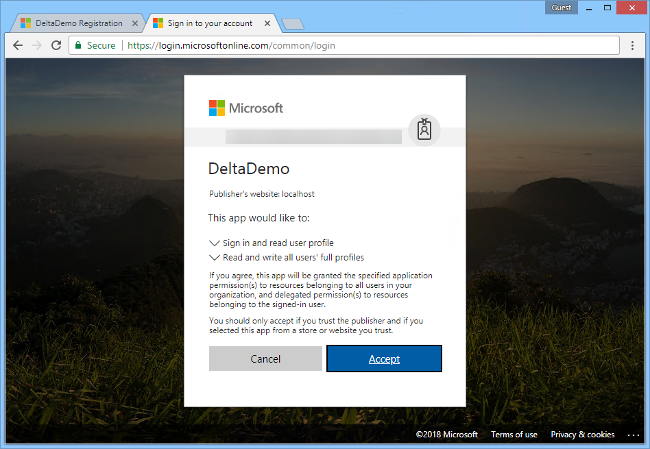
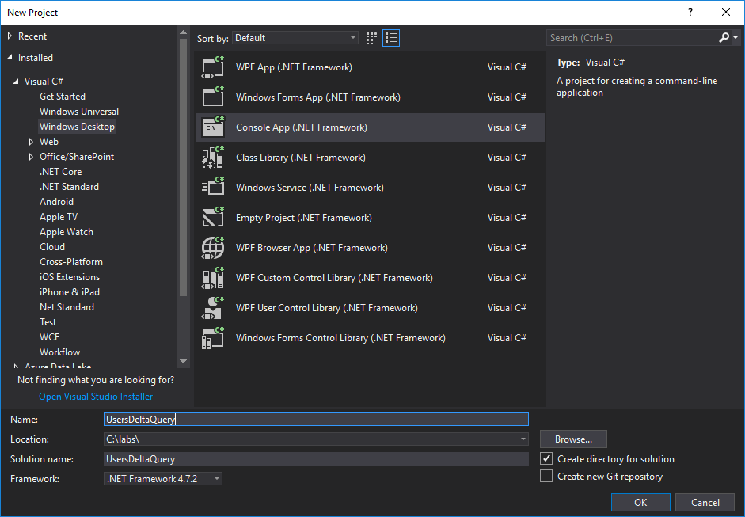
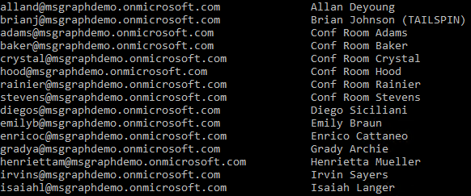

# Microsoft Graph delta queries

This demo will walk you through developing an application using delta queries with Microsoft Graph to request changes to resources.

## Prerequisites

This demo uses **Visual Studio 2017**. It also requires an **Microsoft Office 365 subscription** and a user with administrative privileges as well as a **Microsoft Azure subscription**. If you do not have an Microsoft Azure subscription, get started by creating a [free Microsoft Azure subscription](https://azure.microsoft.com/free).

## Register and grant consent to the application

1. Visit the [Application Registration Portal](https://apps.dev.microsoft.com). Register a new converged application and copy the generated app ID for later use.

1. You will need to configure the application. Generate a new application password secret. Copy it for later use.

1. Add a native application platform and copy the generated URL for later use.

1. Add an application permission for the `User.ReadWrite.All` scope.

1. Save your changes.

    

1. The application requests an application permission with the `User.ReadWrite.All` scope. This permission requires administrative consent. Copy the following URL and replace the `{clientId}` placeholder with your application's client ID from the application registration portal.

    ```
    https://login.microsoftonline.com/common/adminconsent?client_id={clientId}&redirect_uri=http://localhost
    ```

1. Paste the resulting URL into a browser. 

1. Log in when prompted. You must sign in as an administrative user.

    

1. After signing in, you are prompted to consent to permission requests to read and write all users full profiles and to sign in and read the current user's profile. Choose **Accept**.

    

    > **Note:** There is approximately a 20 minute data replication delay between the time when an application is granted admin consent and when the data can successfully synchronize. For more information, read this [article](https://github.com/Azure-Samples/active-directory-dotnet-daemon-v2/issues/1).

    > **Note:** You will receive an error indicating a bad request. This is expected. You did not create a web application to listen for HTTP requests on localhost, Azure AD is telling you that it cannot redirect to the requested URL. Building a web application for admin consent is out of scope for this lab. However, the URL in the browser shows that Azure AD is telling you that admin consent has been granted via the `admin_consent=True` in the URL bar.

    

## Create a new console application

1. In **Visual Studio 2017**, create a new console application named **UsersDeltaQuery**.

    

1. Right-click the project and choose **Manage NuGet Packages**.

1. Select the **Browse** tab in the **NuGet Package Manager** window. Ensure the **Include prerelease** checkbox is checked.

1. Search for and install the following NuGet packages:
    - `Microsoft.Graph`
    - `Microsoft.Identity.Client`

1. Right-click the **References** node in the project and choose **Add Reference**. 

1. Add a reference for `System.Configuration`.

1. Edit the **App.config** file and provide the settings from your registered application.

    ```xml
    <add key="clientId" value="" />         <!-- ex: c7d838fa-8885-442d-889c-7d25567dd2c1 -->
    <add key="clientSecret" value="" />     <!-- ex: ehY7gK57f!29 -->
    <add key="tenantId" value="" />         <!-- ex: contoso.onmicrosoft.com -->
    ```

1. Edit the **Program.cs** file and replace its contents.

    ```csharp
    using Microsoft.Graph;
    using Microsoft.Identity.Client;
    using System;
    using System.Configuration;
    using System.Net.Http.Headers;
    using System.Threading.Tasks;

    namespace UsersDeltaQuery
    {
        class Program
        {
            static void Main(string[] args)
            {
                RunAsync(args).GetAwaiter().GetResult();
                Console.WriteLine("Press any key to finish.");
                Console.ReadKey();
            }

            static async Task RunAsync(string[] args)
            {

                var clientId = ConfigurationManager.AppSettings["clientId"];
                var tenantId = ConfigurationManager.AppSettings["tenantId"];
                var authorityFormat = ConfigurationManager.AppSettings["authorityFormat"];

                ConfidentialClientApplication daemonClient = new ConfidentialClientApplication(
                    ConfigurationManager.AppSettings["clientId"],
                    String.Format(authorityFormat, tenantId),
                    ConfigurationManager.AppSettings["replyUri"],
                    new ClientCredential(ConfigurationManager.AppSettings["clientSecret"]),
                    null,
                                        new TokenCache());

                GraphServiceClient graphClient = new GraphServiceClient(
                    "https://graph.microsoft.com/v1.0",
                    new DelegateAuthenticationProvider(
                        async (requestMessage) =>
                        {
                            var authenticationResult = await daemonClient.AcquireTokenForClientAsync(new string[] { "https://graph.microsoft.com/.default" });
                            requestMessage.Headers.Authorization = new AuthenticationHeaderValue("bearer", authenticationResult.AccessToken);
                        }));

                Console.WriteLine("=== Getting users");

                //Get the list of changed users
                var userPage = await graphClient.Users
                    .Delta()
                    .Request()
                    .Select("displayName,userPrincipalName")
                    .GetAsync();

                //Display users and get the delta link
                var deltaLink = await DisplayChangedUsersAndGetDeltaLink(userPage);

                Console.WriteLine("=== Adding user");

                //Create a new user
                var u = new User()
                {
                    DisplayName = "UsersDeltaQuery Demo User",
                    GivenName = "UsersDeltaQueryDemo",
                    Surname = "User",
                    MailNickname = "UsersDeltaQueryDemoUser",
                    UserPrincipalName = Guid.NewGuid().ToString() + "@" + tenantId,
                    PasswordProfile = new PasswordProfile() { ForceChangePasswordNextSignIn = true, Password = "D3m0p@55w0rd!" },
                    AccountEnabled = true
                };
                var newUser = await graphClient.Users.Request().AddAsync(u);

                Console.WriteLine("Press any key to execute delta query.");
                Console.ReadKey();
                Console.WriteLine("=== Getting users");

                //Query using the delta link to see the new user
                userPage.InitializeNextPageRequest(graphClient, deltaLink);
                userPage = await userPage.NextPageRequest.GetAsync();

                //Display again... notice that only the added user is returned
                var newDeltaLink = await DisplayChangedUsersAndGetDeltaLink(userPage);
                while(deltaLink.Equals(newDeltaLink))
                {
                    //If the two are equal, then we didn't receive changes yet
                    //Query using the delta link to see the new user
                    userPage.InitializeNextPageRequest(graphClient, deltaLink);
                    userPage = await userPage.NextPageRequest.GetAsync();
                    newDeltaLink = await DisplayChangedUsersAndGetDeltaLink(userPage);
                }

                Console.WriteLine("=== Deleting user");
                //Finally, delete the user
                await graphClient.Users[newUser.Id].Request().DeleteAsync();

            }

            static async Task<string> DisplayChangedUsersAndGetDeltaLink(IUserDeltaCollectionPage userPage)
            {

                //Iterate through the users
                foreach (var user in userPage)
                {
                    if(user.UserPrincipalName != null)
                    Console.WriteLine(user.UserPrincipalName.ToLower().Replace("m365x287476","msgraphdemo") + "\t\t" + user.DisplayName);
                }
                while (userPage.NextPageRequest != null)
                {
                    //Console.WriteLine("=== NEXT LINK: " + userPage.NextPageRequest.RequestUrl);
                    //Console.WriteLine("=== SKIP TOKEN: " + userPage.NextPageRequest.QueryOptions[0].Value);

                    userPage = await userPage.NextPageRequest.GetAsync();
                    foreach (var user in userPage)
                    {
                        if (user.UserPrincipalName != null)
                            Console.WriteLine(user.UserPrincipalName.ToLower().Replace("m365x287476", "msgraphdemo") + "\t\t" + user.DisplayName);
                    }
                }

                //Finally, get the delta link
                string deltaLink = (string)userPage.AdditionalData["@odata.deltaLink"];
                //Console.WriteLine("=== DELTA LINK: " + deltaLink);

                return deltaLink;
            }
        }
    }

    ```

## Run the application

1. Run the application. Your application will make a delta query request to Microsoft Graph for users. The first query will return all users because you do not yet have a deltaLink to query.

    

1. In order to force a change, you will add a new user using the Microsoft Graph API. Because these are asynchronous methods, the code execution will pause waiting for you to press a key to continue. This allows you to verify that the newly created `UsersDeltaQuery Demo User` user has been added to your tenant before executing the delta query.

    You can un-comment the lines in the method that displays the user data to also show the `nextLink`, `skipToken`, and `deltaLink` values.

    

1. Another delta query request is made to the Microsoft Graph against the users resource, this time using the `deltaQuery`. Only the newly added user is returned.

    

1. Finally, the newly created user is deleted.